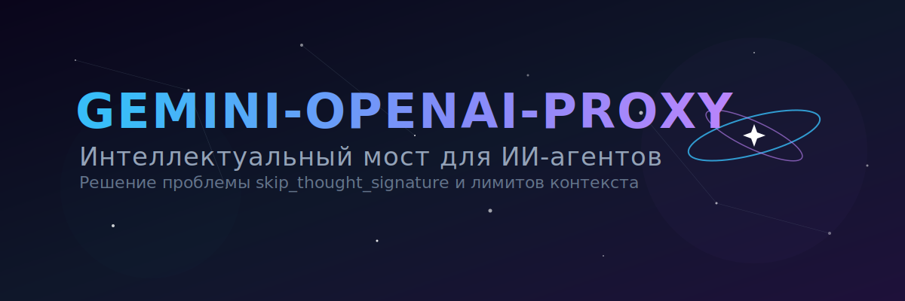
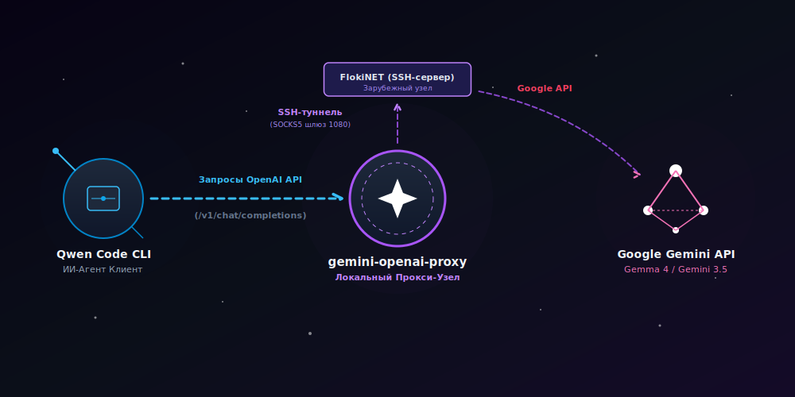
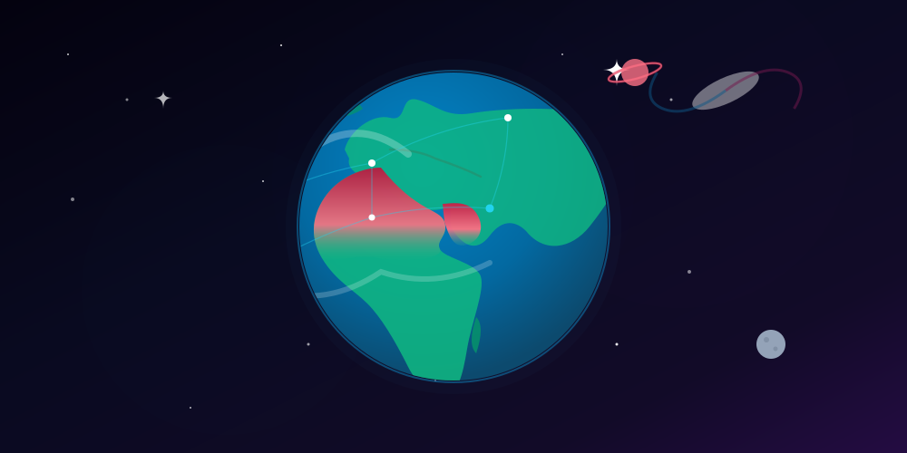

# Gemini-openai-proxy



**Gemini-openai-proxy** — это специализированный локальный прокси-сервер для трансляции запросов из формата OpenAI API в формат Google Gemini API. Проект разработан для обеспечения совместимости автономных ИИ-агентов (таких как Qwen Code CLI и Goose) с моделями семейства Gemma-4 и Gemini непосредственно на локальном компьютере под управлением Windows 10.

---

## 🛠️ Какие задачи решает проект?

При интеграции локальных CLI-инструментов с моделями Google через OpenAI-совместимые протоколы возникают системные несовместимости. Данный прокси-сервер устраняет их, выполняя следующие функции:

1. **Эмуляция интерфейса OpenAI**: Преобразует стандартные входящие HTTP-запросы эндпоинта `/v1/chat/completions` (включая стриминг ответов SSE и вызовы инструментов Function Calling) в формат, соответствующий спецификации Google.
2. **Кэширование и подстановка подписей рассуждений (`thought_signature`)**: Автоматически перехватывает, кэширует во временной директории ОС и передает обратно уникальные цепочки рассуждений моделей Google. При вызове инструментов прокси-сервер инжектирует заглушку `skip_thought_signature_validator` или сохраненную подпись, предотвращая падение сессии с ошибками `500 INTERNAL` или `400 Bad Request`.
3. **Обработка лимита контекста**: Корректно переводит специфичные ошибки переполнения токенов Google в стандартный ответ OpenAI с кодом `context_length_exceeded`. Это позволяет ИИ-клиенту распознать превышение лимита, запустить внутренний механизм сжатия истории сообщений и продолжить выполнение задач без аварийного завершения.
4. **Очистка служебных полей**: Удаляет нестандартные метаданные Google из JSON-ответов перед отправкой клиенту, защищая строгие парсеры от сбоев при разборе данных.
5. **Безопасное SOCKS5-проксирование**: Перенаправляет исходящие запросы к API Google через локальный порт, связанный с шифрованным SSH-туннелем к удаленному шелл-серверу (например, FlokiNET в Исландии), обеспечивая стабильный обход региональных ограничений.

---

## 📊 Схема маршрутизации трафика



---

### Архитектура взаимодействия компонентов

Вся цепочка обработки данных от ввода команды в терминале до получения ответа от Google Gemini работает по гибридному принципу:

1. **Локальный веб-сервер (`gemini_local_proxy.js` на порту `3000`)**: Работает на компьютере с Windows 10. Он принимает запросы от Qwen Code CLI в формате OpenAI, трансформирует их, обрабатывает подписи `thought_signature` и возвращает очищенный поток данных.
2. **Безопасный туннель авторизации**: Позволяет локальному компьютеру безопасно подключаться к внешнему шелл-серверу по протоколу SSH с использованием пары ключей без необходимости ручного ввода пароля при каждом запуске.
3. **Локальный SOCKS5-шлюз (`127.0.0.1:1080`)**: Создается локальным SSH-клиентом при установке динамического перенаправления портов (Dynamic Port Forwarding) к удаленному шелл-серверу. Прокси-сервер перенаправляет подготовленные запросы на этот порт, откуда они в зашифрованном виде передаются на удаленный сервер, выполняющий конечный запрос к Google Gemini.

### Пошаговый путь прохождения запроса

1. **Инициация**: Вы отправляете запрос в консоли Qwen Code CLI. Клиент считывает конфигурацию из `settings.json`, видит локальный адрес `http://127.0.0.1:3000/...` и направляет запрос на порт `3000` вашей локальной машины.
2. **Обработка**: Скрипт `gemini_local_proxy.js` принимает запрос, транслирует структуру сообщений в формат Google, извлекает из временного хранилища соответствующие подписи `thought_signature` и формирует исходящий пакет.
3. **Перенаправление**: Прокси-сервер считывает настройки из `.env` и перенаправляет запрос на локальный SOCKS5-порт `127.0.0.1:1080`.
4. **Шифрование и транзит**: Локальный SSH-клиент зашифровывает данные и передает их по открытому SSH-каналу на внешний шелл-сервер. Сетевой провайдер фиксирует только защищенное SSH-соединение.
5. **Запрос к API**: Внешний шелл-сервер расшифровывает полученные данные и выполняет прямой HTTPS-запрос к официальному адресу Google Gemini API. Для систем Google этот запрос исходит от доверенного IP-адреса.
6. **Обратный поток**: Ответ от Google возвращается по зашифрованному туннелю на ваш локальный порт `1080`. Прокси-сервер забирает ответ, извлекает и кэширует новые подписи мыслей модели, удаляет специфичные для Google поля и передает поток ответов обратно в Qwen Code CLI.

---

## 🔒 Безопасность и локальная изоляция

При работе на локальном компьютере под управлением Windows 10 безопасность обеспечивается следующими мерами:

- **Изоляция сокета (Loopback)**: В файле конфигурации `.env` параметр `HOST` настроен на локальный адрес `127.0.0.1`. Это означает, что порт `3000` физически не принимает входящие подключения из внешней локальной сети (LAN) или интернета.
- **Брандмауэр Windows**: Автоматически блокирует любые несанкционированные попытки внешнего сканирования портов вашего ПК, в то время как внутренний обмен данными между процессами внутри операционной системы происходит беспрепятственно.
- **Шифрование трафика**: Все исходящие запросы к Google Gemini маскируются под стандартную терминальную работу по протоколу SSH, исключая перехват метаданных провайдером.

---

## 🔑 Настройка беспарольного доступа по SSH

Для автоматической работы SOCKS5-туннеля необходимо настроить авторизацию по ключу между вашим ПК и удаленным шелл-сервером (например, FlokiNET в Исландии).

Выполните следующие шаги в терминале **PowerShell 7**:

### 1. Генерация пары ключей на локальном компьютере

Если у вас еще нет ключей, создайте их с помощью современной сигнатуры Ed25519:

```powershell
ssh-keygen -t ed25519 -C "your_email@example.com"
```

При запросе пути сохранения и пароля нажимайте `Enter` (оставьте поля пустыми). Публичный ключ сохранится по пути:  
`C:\Users\[username]\.ssh\id_ed25519.pub`

### 2. Копирование публичного ключа на удаленный сервер

Откройте файл `id_ed25519.pub` в текстовом редакторе и скопируйте его содержимое (однострочный текст, начинающийся с `ssh-ed25519`).

Подключитесь к вашему удаленному шелл-серверу по паролю, откройте или создайте файл авторизованных ключей и вставьте туда скопированную строку:

```bash
# Выполняется на удаленном сервере:
mkdir -p ~/.ssh
chmod 700 ~/.ssh
nano ~/.ssh/authorized_keys
```

_Вставьте ключ, сохраните файл (`Ctrl+O`, `Enter`) и выйдите (`Ctrl+X`)._ Установите корректные права доступа на файл:

```bash
chmod 600 ~/.ssh/authorized_keys
```

### 3. Проверка подключения

Убедитесь, что подключение из PowerShell 7 теперь происходит мгновенно без запроса пароля:

```powershell
ssh username@your_remote_server_host
```

---

## ⚙️ Установка и конфигурация

### Системные требования

- **Операционная система**: Windows 10
- **Среда выполнения**: Node.js **`v22.13.1`** (или выше)
- **Терминал**: PowerShell 7

### 1. Настройка ИИ-агента (`settings.json`)

Интегрируйте конфигурацию поддерживаемых моделей в файл настроек Qwen CLI, расположенный по пути:  
`C:\Users\[username]\.qwen\settings.json`

```json
{
  "model": {
    "name": "gemma-4-31b-it",
    "baseUrl": "http://127.0.0.1:3000/v1beta/openai/"
  },
  "modelProviders": {
    "openai": [
      {
        "id": "gemini-3.1-flash-lite",
        "name": "Google Gemini-3.1-Flash-Lite",
        "baseUrl": "http://127.0.0.1:3000/v1beta/openai/",
        "envKey": "GEMINI_API_KEY",
        "generationConfig": {
          "contextWindowSize": 250000
        }
      },
      {
        "id": "gemma-4-31b-it",
        "name": "Google Gemma-4-31B-IT",
        "baseUrl": "http://127.0.0.1:3000/v1beta/openai/",
        "envKey": "GEMINI_API_KEY",
        "generationConfig": {
          "contextWindowSize": 262144,
          "timeout": 180000
        }
      },
      {
        "id": "gemma-4-26b-a4b-it",
        "name": "Google Gemma-4-26B-A4B-IT",
        "baseUrl": "http://127.0.0.1:3000/v1beta/openai/",
        "envKey": "GEMINI_API_KEY",
        "generationConfig": {
          "contextWindowSize": 262144,
          "timeout": 180000
        }
      }
    ]
  }
}
```

### 2. Параметры локального прокси (`.env`)

Создайте файл `.env` в корневой директории проекта `E:\PR\PR_R\gemini_local_proxy\.env` на основе шаблона `.env.example`:

```ini
# Настройки локального сервера прокси
PORT=3000
HOST=127.0.0.1

# Настройки подключения к SOCKS5 (туннель через внешний хостинг)
SOCKS_PROXY=socks5h://127.0.0.1:1080

# API-ключ Google Gemini
# Получите ключ на https://aistudio.google.com/app/apikey
GEMINI_API_KEY=your_api_key_here
```

---

## 🚀 Инструкция по запуску

Для полноценной работы системы откройте два окна терминала **PowerShell 7** и выполните следующие действия:

### Окно 1: Инициализация зашифрованного SOCKS5-туннеля

Запустите фоновый туннель на порт `1080` к вашему удаленному шелл-серверу (например, FlokiNET в Исландии):

```powershell
ssh -D 1080 -N username@your_remote_server_host
```

_Параметр `-N` указывает удерживать соединение только для перенаправления портов без открытия интерактивной командной строки._

### Окно 2: Запуск локального прокси-сервера

Перейдите в директорию проекта и запустите Node.js сервер:

```powershell
cd "E:\PR\PR_R\gemini_local_proxy"
node gemini_local_proxy.js
```

После этого ваш локальный ИИ-агент Qwen Code CLI готов к стабильной отправке запросов и получению ответов от моделей семейства Gemma 4 и Gemini 3.5


